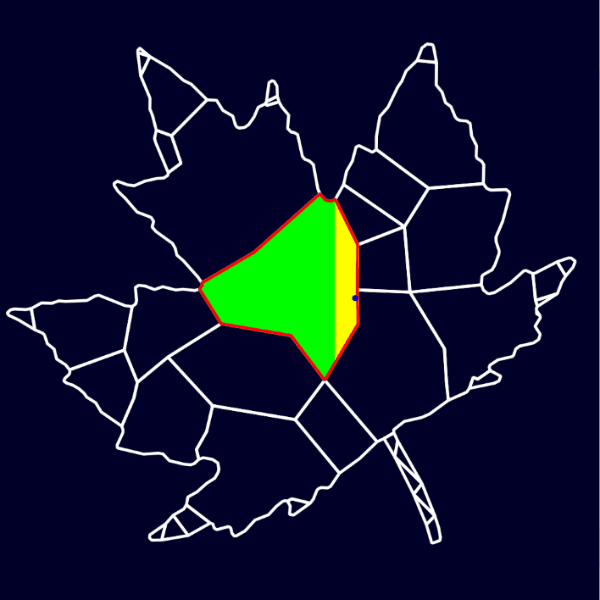
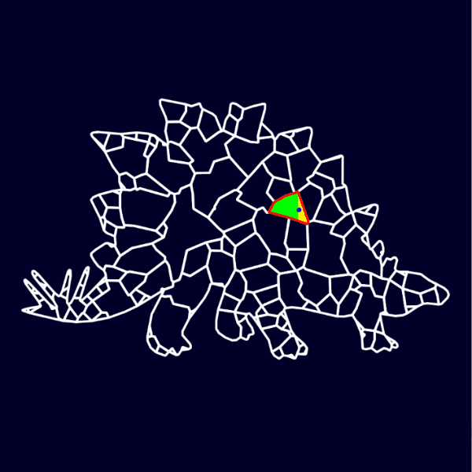
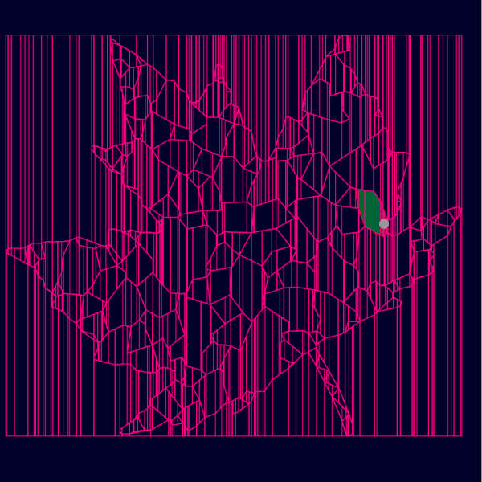
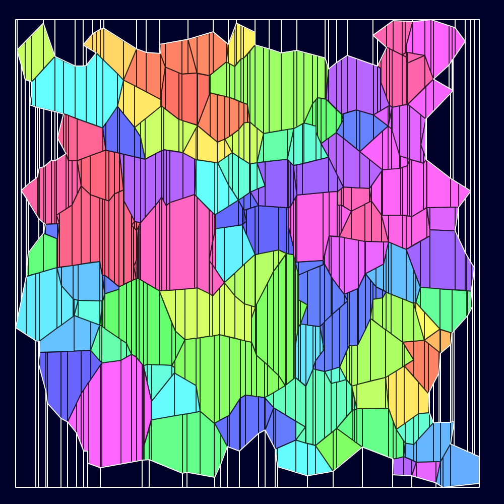

 

# TrapMap

*Trapezoidal Map* library — a data structure for fast point location queries.

## Overview

The problem of planar partitioning and planar point location is a fundamental problem in computational geometry. Given a partition of the plane into disjoint regions, in which region a does a query point lie?

*TrapMap* pre-processes a partitioning of the plane (given as individual line segments, or polygons), decomposing regions into simpler trapezoidal cells upon which a search structure (a directed acyclic graph) is constructed. This structure facilitates a search of the trapezoid (hence the region) containing a query point in *O(log n)* time. The trapezoidal map and the search structure are built via randomized incremental construction.

*TrapMap* is based on _Tyler Chenhall's_ trapezoidal map [implementation](https://github.com/TylerChenhall/TrapezoidalMap). The library has been built for slight interoperability with [Processing](https://processing.org/); it accepts Processing's `PShape` type as polygon input and can output trapezoids of the same type.

## Usage

*TrapMap* is available as a Maven artifact via Jitpack.

Construct a `TrapMap` from a collection of line segments or a list of `PShape` polygons. The trapezoidal map and the search structure are built upon instantiation. It can then be queried as follows:

* `findNearestTrapezoid(x, y)` — Locates the trapezoid which contains a query point.
  * If a query point does not lie inside any trapezoid, this method returns the nearest trapezoid to the point.
* `findContainingTrapezoid(x, y)` — Locates the trapezoid which contains a query point.
  * If the point does not lie inside any trapezoid, this method returns null.
* `findFaceTrapezoids(x, y)` — Finds the group of trapezoids that make up the polygonal face that contains a query point.
* `findContainingPolygon(x, y)` — Locates the polygon which contains a query point.
  * This method has a valid output only when the `TrapMap` is constructed from polygons.
* `getAllTrapezoids()` — Returns all the trapezoids contained in the trapezoid map.

## Gallery

  <a href="examples/partitionSmooth"></a 
    <a href="examples/partitionSmooth"></a 

